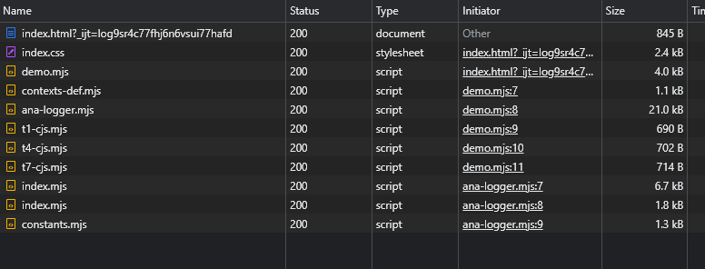

[](https://github.com/thimpat/to-esm/blob/main/README.md)
[](https://github.com/thimpat/to-esm/blob/main/README.md)
[](https://github.com/thimpat/to-esm/blob/main/README.md)
[](https://www.npmjs.com/package/to-esm)


## Description


A tool to convert Commonjs files into ESM.


<br>


---

## Installation


```shell

npm install to-esm -g

```


<br>


---

## Usage


```shell

to-esm --input=<inputFilesPattern> [--output=<outputDirectory>] [--html=<htmlFilePattern>] [--noheader] 
[--target=<browser|esm>]

```


<br>

---

## Examples

<br/>

## 📋

### Generate ESM code from a CommonJs file

> **to-esm should run from the project root folder.** 

To generate an **.mjs**(ES module) file from a **.js** file:

---

```shell
💻 > 
# Command
to-esm  example/cjs/input.cjs
```
---
###### ⏳ - Before (command)

```
📁project                 ⇽ Ran from here
│
└───📁example
│   │
│   └───📁code
│       │   📝 library.js
│       │   📝 demo.js   ⇽
│       │   ...
│
```

📝 _library.js_ ↴
```javascript
function hi() 
{
    console.log(`I wanted to say hi!`)
}
module.exports = hi;
```

📝 _demo.js_ ↴
```javascript
const hi = require("./library.js");
hi();
```

<br/>

###### ⌛ After

```
📁project
│
└───📁example
│   │
│   └───📁code
│       │   📄 library.js
│       │   📄 demo.js
│       │   📝 library.mjs   ⇽
│       │   ...
│
└ 📝 demo.mjs     ⇽
```

📝 _library.js_ ↴
```javascript
function hi()
{
    console.log(`I wanted to say hi!`)
}

export default hi;
```

📝 _demo.js_ ↴
```javascript
import hi  from "./example/code/library.mjs";
hi();
```

The file given as entrypoint will be converted inside the working 
directory. The others, will depend on the source location.

**./example/cjs/input.cjs => ./example/cjs/input.mjs 📝** 


<br/><br/><br/><br/>

---

<br/><br/><br/><br/>


## 📋

### Generate ESM code to a dedicated directory

> --output < folder >

```shell
💻 > 
# Command
to-esm  example/cjs/input.cjs --output generated/esm
```
---
#### ⏳ - Before

```
📁project                 ⇽ Ran from here
│
└───📁example
│   │
│   └───📁code
│       │   📝 library.js
│       │   📝 demo.js   ⇽ 🚩
│       │   ...
```

<br/>

#### ⌛ After

```
📁project                 
│
└───📁example
│   │
│   └───📁code
│       │   📝 library.js
│       │   📝 demo.js   
│       │   ...
│
└───📁generated
│   └───📁esm
│       └───📁example   
│           └───📁code
│                  📝 library.mjs ⇽ 🚩
│                  📝 demo.mjs   ⇽ 
│                   ...
```

##### Checking the conversion has succeeded
```shell
node generated/demo.mjs
```

<br/><br/><br/><br/>

---

<br/><br/><br/><br/>


## 📋

### Remove generated automatic header

> --noheader


```shell
💻 > 
# Command
to-esm  example/cjs/input.cjs --output generated --noheader
```
---
#### ⏳ - Without the --noheader option

```javascript
/**
 * DO NOT EDIT THIS FILE DIRECTLY.
 * This file is generated following the conversion of 
 * [./example/code/demo.js]{@link ./example/code/demo.js}
 * 
 **/
import hi  from "./example/code/library.mjs";
hi();
```
<br/>

#### ⌛ With the --noheader option

```javascript
import hi  from "./example/code/library.mjs";
hi();
```

<br/><br/><br/><br/>

---

<br/><br/><br/><br/>


## 📋

### Generate code for the browser

> **--target** < **browser** | esm | all >

###### 💻 
```shell
# Command
to-esm  example/cjs/input.cjs --output generated --target browser
```
---

#### 1- When generating code for the browser, **to-esm** will display a warning when the code uses a native Node library.

📝 _demo.js_ ↴
```javascript
const path = require("path");                   // See directives below to see how to remove this call
function hi()
{
    console.log(`I wanted to say hi!`)
}

module.exports = hi;
```

```shell
💻 >
to-esm: (1130) ================================================================
to-esm: (1132) Processing: ./example/code/demo.js
to-esm: (1134) ----------------------------------------------------------------
to-esm: (1060) ✔ SUCCESS: Converted [./example/code/demo.js] to [generated-browser\demo.mjs]
to-esm: (1150) 
to-esm: (1130) ================================================================
to-esm: (1132) Processing: ./example/code/library.js
to-esm: (1134) ----------------------------------------------------------------
to-esm: (1017) path is a built-in NodeJs module. ⇽ 🚩
to-esm: (1060) ✔ SUCCESS: Converted [./example/code/library.js] to [generated-browser\example\code\library.mjs]
to-esm: (1150) 

```

#### 2- To load your files in the HTML code, you only point to the entry file (demo.js).

The browser will automatically load the other files.


> **demo.mjs** is the entrypoint. 

All of the connected files are automatically loaded by the browser.
<br/>



---

> **Many advantages comes from this:**
> 
> - You do not need a sourcemap when working in development
> - You do not need to bundle your code in development (so no wait time)
> - You benefit directly from your **browser caching ability** (No more bundling of common libraries)
> - The generated code looks like the original code.
> - ... 


---

When there is a requirement to load libraries from the node_modules folder,
to-esm will generate a converted copy of the files to the output directory.

📝 _demo.js_ ↴
```javascript
const toAnsi = require("to-ansi");
const rgbHex = require("rgb-hex-cjs");
const {COLOR_TABLE, SYSTEM} = require("./some-lib.js");
// ...
```

```
📁project  
└─── 📝 index.html                 
└─── 📝 demo.js
└─── 📝 some-lib.js
└─── 📁 node_modules
│    │
│    └───📁 rgb-hex
│    │        📝 index.cjs
│    │            ...
│    └───📁 to-ansi
│             📝 index.cjs 
│                ...
└───📁src
└───📁unrelated
```

When these files are under the entry point, they are easily accessible (See importmap section for more configuration).


<br/><br/><br/><br/>

---

<br/><br/><br/><br/>


## 📋


### Automatically write an importmap within html files

An import map will allow writing named things like ```import rgbhex from "rgb-hex"``` 

whole path ```import rgbhex from "../../../path/to/rgb-hex.mjs"``.

```shell
# Generates => 📝 ./example/cjs/input.mjs

to-esm --input="example/cjs/demo.cjs" --output=generated/browser/ --config=".toesm.cjs" --html=example/*.html
```

###### See below to see how to structure .toesm.cjs

📝 index.html ↴
```html
<!DOCTYPE html>
<html lang="en">
<head>
    <script type="importmap">
        {
          "imports": {
            "rgb-hex": "./node_modules/rgb-hex/index.cjs"
          }
        }
    </script>
</head>
<body>
<script type="module" src="actual/demo-test.mjs"></script>
</body>
</html>
```

<br>


### Convert all .cjs and .js files into example/esm keeping folder structure

Note that it is only helpful to do this when the files are not connected to each other (or some conversions failed)

```shell

to-esm  --input="example/cjs/*.?(c)js" --output=example/esm/

```

<br>


### We can specify multiple directories if necessary

```shell

to-esm  --input="folder1/cjs/**/*.?(c)js" --input="folder2/**/*.cjs" --output=outdir1/esm/ --output=outdir2/esm/

```


<br><br>


## Options (via command line)


| **Options**  | **Description**                                   |                          |
|--------------|---------------------------------------------------|--------------------------
| --input      | _File list to convert_                            | **Only required option**
| --output     | _Output directory_                                | directory path
| --html       | _html files to receive importmaps_                | glob
| --noHeader   | _Options to not generate automatic header_        |
| --withReport | _Output conversion in the console_                |
| --target     | _Setting the targeted environment_                | all / esm / browser      |  
| --bundle     | _Generate minify version for browser environment_ | file path                |  
| --entrypoint     | _Path to .cjs entrypoint_                         | file path                |  
| --update-all | _Modify package.json to set entry points_         |                          |  


<br><br>


## Advanced Options (via config file)


To apply advanced options, create a config file and make the CLI point to it.

>
> to-esm --input=... --output=... --config=.to-esm.cjs


Keys within the config file are case sensitive.


### Options to replace strings before and after every conversion

#### [replaceStart, replaceEnd]

📝 .toesm.cjs ↴

```javascript

module.exports = {
    replaceStart: [
        {
            search : "const chalk = require(\"chalk\");",
            replace: "// ***"
        },
        {
            search : /const\s+colors\s*=\s*require\(.colors.\);/g,
            replace: "// ***"
        }
    ],
    replaceEnd  : [
        {
            search : `// ***`,
            replace: "// --------- chalk and colors were replaced ----------------"
        }
    ]
}

```

| **Options**          | **Description**                                                       | 
|----------------------|-----------------------------------------------------------------------|
| replaceStart         | _will perform a replacement **_before_** doing the conversion to ESM_ |
| replaceEnd           | _will perform a replacement **_after_** doing the conversion to ESM_  |
| replaceStart.search  | _The regex pattern or string to replace_                              |
| replaceStart.replace | _The replacement sentence_                                            |


<br><br>


### Options to use two different modules of the same library.

#### [replaceModules]

Sometimes, you may find libraries where only ESM is available when CJS was available on older versions.

This option allows setting a different version depending on the environment used.

For instance, the module "chalk" uses ESM for its Export on its latest version (5.0.0) and CJS for the older version (4.

1.2).

You can setup toesm to use the appropriate version depending on your config file:


📝 .toesm.cjs ↴

```javascript
module.exports = {
    replaceModules:
        {
            "rgb-hex":
                {
                    cjs: {
                        name   : "rgb-hex-cjs",
                        version: "@^3.0.0"
                    },
                    esm: {
                        version: "@latest"
                    }
                }
        },
    }        
```


In the .cjs file to convert, you would write:

```javascript
const rgbhex = require("rgb-hex-cjs");
```

Which is going to be transformed to:

```javascript
import rgbhex  from "RGB-hex";
```


| **Options**                       | **Description**                                         | 
|-----------------------------------|---------------------------------------------------------|
| replaceModules[\<moduleName>]     | _The module we want to use two different versions with_ |
| replaceModules[\<moduleName>].cjs | _The module version to use with CommonJs files_         |
| replaceModules[\<moduleName>].mjs | _The module version to use with converted files_        |


<br><br>


### Options to set html sources and manipulate importmaps.

####[html]

```html
module.exports = {
    html          :
        {
            pattern: "/index.html",
            importmap       : {
                "ttt": "http://somewhere"
            },
            importmapReplace: [{
                search : "./node_modules",
                replace: `/node_modules`,
            }],
        }
}
```


| **Options**                       | **Description**                                    | 
|-----------------------------------|----------------------------------------------------|
| pattern                    | _HTML file pattern where importmap needs updating_ |
| importmap                    | _value to add to html files_                       |
| importmapReplace                             | _Apply replacements on the importmap list_         |


<br/><br/>

##### Quick description

When we specify "importmap" in the browser,
instead of using long paths to identify the location of a library, we can use identifiers to state their place.

For instance, with this html:

```html

    <script type="importmap">
        {
          "imports": {
            "my-project": "../node_modules/my-project/src/esm/add.mjs",
            "lodash": "https://cdn.jsdelivr.net/npm/lodash@4.17.10/lodash.min.js"  // ← Example 
          }
        }
    </script>

```

Instead of writing:
```javascript
import {add} from "../node_modules/my-project/src/esm/add.mjs"
```

We can write this:

```javascript
import {add} from "my-project"
```


---

## Directives

### Directives to replace code directly from the source.

You can, if you want, also use some to-esm directives within the code.
For instance, the code below will not appear when the target is a browser.

```javascript
/** to-esm-browser: remove **/
const path = require("path");
const fs = require("fs");
const os = require("os");
/** to-esm-browser: end-remove **/
```


<br><br>

### Directives to add code to the source.

It is also possible to add code.

📝 code.cjs ↴
```javascript
/** to-esm-browser: add
    this.realConsoleLog("LogToFile is not supported in this environment. ")
* **/
```

In this example, after conversion, the above code will become this:

📝 code.mjs (with target browser) ↴
```javascript
this.realConsoleLog("LogToFile is not supported in this environment. ")
```

<br><br>

---

### Directives to ignore code during the parsing, so it won't be converted by mistake.

```javascript
/** to-esm-all: skip **/
console.log("Skip this");
/** to-esm-all: end-skip **/
```

<br><br>

---

## Troubleshooting


### 😓 Uncaught SyntaxError: The requested module '***' does not provide an export named '...'


### Quick Fix => Use named exports


Replace structure like:

```javascript

module.exports = {
    COLOR_TABLE: ["#FFA07A", "#FF7F50", "#FF6347"]
}
```

with:

```javascript

module.exports.COLOR_TABLE = ["#FFA07A", "#FF7F50", "#FF6347"];
```

<br><br>


<br><br><br><br>


<br><br><br><br>
## Create a Hybrid Library


<br><br>


### 1- Have all of your CommonJs code in a subdirectories


Here we put all of our existing code within the cjs directory.


<br/>


### 2- Change CommonJs file extensions to .cjs


Refactor the files that use CommonJs modules to have the new .cjs extensions.


<br/>


### 3- Run the to-esm command


Generate the ESM code into the targeted directory.


```shell

to-esm.cmd --input="src/cjs/**/*.?(c)js" --output=src/esm/

```


<br/>


###### ⭐ Overview ↴


### 4- Update your package.json to point to the correct target based on the environment


```JSON

{
  "name": "my-project",
  "version": "1.0.0",
  "description": "",
  "main": "src/cjs/add.cjs",             ←
  "module": "src/ejs/add.mjs",           ← 
  "type": "module",                      ←  
  "scripts": {
    "gen:esm": "toesm.cmd --input=\"src/cjs/demo.cjs\" --output=src/esm/"
  },
  "exports": {
    ".":{
      "require": "./src/cjs/add.cjs",    ←
      "import": "./src/esm/add.mjs"      ←
    }
  },
  "author": "",
  "license": "ISC"
}
```

