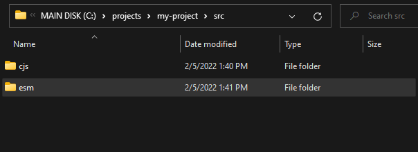
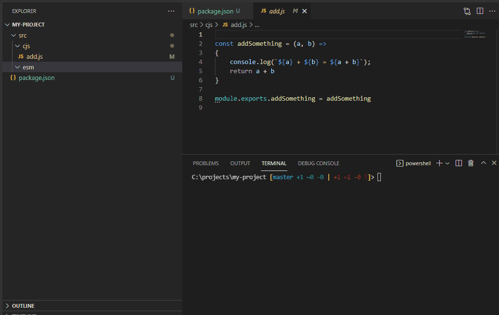

## Description

Straightforward tool to convert Commonjs files into ESM

<br>

---
## Installation

```shell
npm install to-esm -g
```

<br>

---
## Usage

```shell
toesm --input=<inputFilesPattern> [--output=<outputDirectory>] [--noheader]
```

<br>

### Examples

The following examples will work on a folder structure that looks like this:
>
> example/cjs/input.js
>
> example/cjs/dep-1.cjs
>
> example/cjs/dep-2.cjs

<br>

### Create a copy of input.js and convert it to ESM (input.mjs)
```shell
# Generates => 📝 ./example/cjs/input.mjs
toesm  --input=example/cjs/*.js
```

<br>

### Convert input.js copy (all .js in this directory) to a different location
```shell
# Generates => 📝 ./example/esm/input.mjs
toesm  --input=example/cjs/*.js --output=example/esm/
```
<br>

### Convert all .cjs and .js files
```shell
toesm  --input="example/cjs/*.?(c)js" --output=example/esm/
```

<br>

### In this example, we also, convert files in subdirectories (keeping folder structure)
```shell
toesm  --input="example/cjs/**/*.?(c)js" --output=example/esm/
```

<br>

### When dealing with multiple folders, it's best to use this format (For better path resolution)
```shell
toesm  --input="folder1/cjs/**/*.?(c)js" --input="folder2/**/*.cjs" --output=outdir1/esm/ --output=outdir2/esm/
```

<br><br>

---
## Options

<br><br>

### Options to not generate automatic header
>
> --noheader

<br>

## Advanced Options (via config file)

To apply advanced options, create a config file and make the CLI point to it.
>
> toesm --input=... --output=... --config=.toesm.js


### Options to replace strings before and after every conversion

📝 .toesm.js ↴
```javascript
module.exports = {
    replaceStart: [
        {
            search : /const\s+chalk\s*=\s*require\(.chalk.\);/g,
            replace: "// ***"
        },
        {
            search : /const\s+colors\s*=\s*require\(.colors.\);/g,
            replace: "// ***"
        }
    ],
    replaceEnd  : [
        {
            search : `// ***`,
            replace: "// --------- chalk and colors was replaced ----------------"
        }
    ]
}
```

**_replaceStart_** will perform a replacement **_before_** doing the conversion to ESM

**_replaceEnd_** will perform a replacement **_after_** doing the conversion to ESM

**_search_** can be a plain string or a regex
<br><br>

### Options to use two different modules of the same library.

Sometimes, you may find libraries where only ESM is available when CJS was available on older versions.
This option allows setting a different version depending on the environment used.
For instance, the module "chalk" uses ESM for its export on its latest version (5.0.0) and CJS for the older version (4.
1.2).
You can setup toesm to use the appropriate version depending on your config file:

📝 .toesm.js ↴
```javascript
module.exports = {
    replaceModules:
        {
            chalk: {
                cjs: {
                    name: "chalk-cjs",
                    version: "@^4.1.2"
                },
                esm: {
                    version: "latest"
                }
            },
            "color-convert": {
                cjs: {
                    name: "color-convert-cjs",
                    version: "@^2.0.1"
                },
                esm: {
                    version: "latest"
                }
            }
        }
}        
```

In the .cjs file to convert, you would do:

```javascript
import chalk  from "chalk-cjs";
import colorConvert  from "color-convert-cjs";
```
Which is going to be transformed to:

```javascript
import chalk  from "chalk";
import colorConvert  from "color-convert";
```
<br><br>

---
## Troubleshooting

### 😓 Uncaught SyntaxError: The requested module '***' does not provide an export named '...'

### Quick Fix => Use named exports!

Replace things like:
```javascript
module.exports = {
    COLOR_TABLE: ["#FFA07A", "#FF7F50", "#FF6347"]
}
```

with:

```javascript
module.exports.COLOR_TABLE = ["#FFA07A", "#FF7F50", "#FF6347"];
```

or

```javascript
const val = {
    COLOR_TABLE: ["#FFA07A", "#FF7F50", "#FF6347"]
};
module.exports.COLOR_TABLE = val.COLOR_TABLE;
```

<br><br>

### Long Explanation (In case of struggle with the concept of Named Export)

Quite often, when we export a library within the Node environment (CommonJs modules), we do something like:

```javascript
// => 📝 "./my-js" 
module.exports = {
    COLOR_TABLE: ["#FFA07A", "#FF7F50", "#FF6347"]
}
```

Then when comes the time to import it, we do:
```javascript
const {COLOR_TABLE} = require("./my-js");
```

However, after the conversion to ESM, you will find that the export is not "named":

Conversion to ESM of the above code
```javascript
// => 📝 "./my-js.mjs" 
export default {
    COLOR_TABLE: ["#FFA07A", "#FF7F50", "#FF6347"]
}
```

```javascript
import {COLOR_TABLE} from "./my-js.mjs"
```

In this example, the only thing exported is "default". Hence, the system cannot find COLOR_TABLE.


```const {something} = ...``` is different from ≠ ```import {something}```

<br>

##### Destructuring assignment

⇨ ```const {something} = ...``` uses the Destructuring assignment feature of JavaScript (ES6 / ES2015), which is the
reason things like below is possible:
```javascript
const myObject = {something: "Great"}
const {something} = myObject;          
```

<br>

##### Import statement
⇨ ```import {something}``` uses the import ESM feature.

You can't do things like:
```javascript
const myObject = {something: "Great"};
import {something} from myObject;       // 👀 <= myObject is not a file path
```
There is no destructuring here. ESM is expecting a file path.
If myObject were a path, ESM would look into the **table of exported named values** against
the given file to do the assignment.

<br>

###### Named Exports (ESM)
Therefore, the passed file must explicitly export the "something" key.
We could do:

```javascript
// => Named Export
export const something = ...
```
In this example, we have done a named export.

<br>

###### Default Exports (ESM)
For default export, we would do:

```javascript
// => Named Export
export default ...
```

<br>

###### Default Exports (CJS)
The tool, when parsing something like below, is assuming you want to do a default export:
```javascript
module.exports = {
    COLOR_TABLE: ["#FFA07A", "#FF7F50", "#FF6347"],
    COLOR_LINE: ["#FFA07A", "#FF7F50", "#FF6347"],
    COLOR_ROW: ["#FFA07A", "#FF7F50", "#FF6347"],
}
```

<br>

###### Default Exports (CJS)

It could do the named export for you, but things like:
```javascript
module.exports = {
    [MY_VAR]: "Look!",
    COLOR_TABLE: ["#FFA07A", "#FF7F50", "#FF6347"],
    COLOR_LINE: ["#FFA07A", "#FF7F50", "#FF6347"],
    COLOR_ROW: ["#FFA07A", "#FF7F50", "#FF6347"],
}
```

[MY_VAR] uses the Computed property names feature of ES2015, known explicitly at runtime.
Therefore, we let the user do the Name Export instead of assuming.


---

## Create a Hybrid Library

<br><br>

### 1- Have all of your CommonJs code in a subdirectories



Here we put all of our existing code within the cjs directory.

<br/>

### 2- Change CommonJs file extensions to .cjs

Refactor the files that use CommonJs modules to have the new .cjs extensions.

<br/>

### 3- Run the toesm command

Generate the esm code into the targeted directory.

```shell
toesm.cmd --input="src/cjs/**/*.?(c)js" --output=src/esm/
```

<br/>


###### ⭐ Overview ↴



### 4- Update your package.json to point to the correct target based on the environment

```json
{
  "name": "my-project",
  "version": "1.0.0",
  "description": "",
  "main": "src/cjs/add.cjs",             ← 
  "module": "src/ejs/add.mjs",           ←  
  "type": "module",                      ←   
  "scripts": {
    "gen:esm": "toesm.cmd --input=\"src/cjs/**/*.?(c)js\" --output=src/esm/"
  },
  "exports": {
    ".":{
      "require": "./src/cjs/add.cjs",    ← 
      "import": "./src/esm/add.mjs"      ← 
    }
  },
  "author": "",
  "license": "ISC"
}
```

### **Your module is now ready, and your user can do an install with**

```shell
npm install my-project
```

#### To use your library in Node:

```javascript
const {addSomething} = require("my-project");
```

#### In the Browser:

```javascript
import {addSomething} from "my-project";
```

But, this is not enough. Import with ES6 is not as slick as a simple "require()" in NodeJs. It does not have a
dedicated node_modules/ folder along with a package.json.

It has no idea where to find "my-project". ESM is expecting a relative path.

👉 _Note that this code will work when using a bundler as they know where to find that node_modules/ folder.
However, you're handling generated new code._

Users must reference the full path to your ESM entry point to use your ESM code.

```javascript
import addSomething from "../node_modules/my-project/src/esm/add.mjs"
```

**This is expected.** 👈


##### Adding an importmap

To be able to write things like ```import {addSomething} from "my-project";```
on the browser side, you can define an import map.

In the targeted HTML file, define the path to your entry point:

```html
    <script type="importmap">
        {
          "imports": {
            "my-project": "../node_modules/my-project/src/esm/add.mjs",
            "lodash": "https://cdn.jsdelivr.net/npm/lodash@4.17.10/lodash.min.js"  // ← Example 
          }
        }
    </script>

```

Now, imports like

```javascript
import {addSomething} from "my-project";
```
are valid without bundler (or transpiler)


