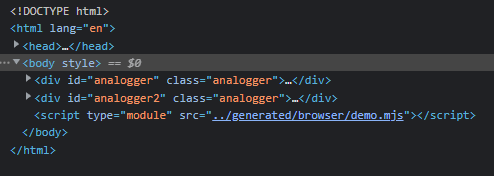

# Table of contents

  1. [Description](#description)
  1. [Installation](#installation)
  1. [Usage](#usage)
  1. [Examples](#examples)
      1. [Generate ESM code](#generate-esm-code)
      1. [Generate code into a dedicated directory](#generate-code-into-a-dedicated-directory)
      1. [Remove automatic generated header](#remove-automatic-generated-header)
      1. [Generate code for the browser](#generate-code-for-the-browser)
      1. [ Generate some importmap within html files](#generate-some-importmap-within-html-files)
      1. [Convert files with patterns](#convert-files-with-patterns)
  1. [Options (via command line)](#options-(via-command-line))
  1. [Advanced Options (via config file)](#advanced-options-(via-config-file))
  1. [Directives](#directives)
  1. [Working with both CJS and ESM](#working-with-both-cjs-and-esm)
  1. [Create a Hybrid Library with to.esm](#create-a-hybrid-library-with-to-esm)
  1. [Create a Hybrid Library with to.esm supporting the browser](#create-a-hybrid-library-with-to-esm-supporting-the-browser)
    1. [Some thoughts](#some-thoughts)
  1. [Plus](#plus)


<br/><br/>

---

[](https://github.com/thimpat/to-esm/blob/main/README.md)
[](https://github.com/thimpat/to-esm/blob/main/README.md)
[](https://github.com/thimpat/to-esm/blob/main/README.md)
[](https://www.npmjs.com/package/to-esm)


---

<br/><br/>

## Description

A tool to convert Commonjs files into ESM files.
To-esm can be used for generating hybrid modules. Do all of your coding using CommonJs, then convert your code into 
ESM at build or packaging times.

<br>

---

## Installation

```shell

npm install to-esm -g

```

<br>

---


## Usage


```shell

to-esm <filepath> [--output=<dirpath>] [--html=<filepath>] [--noheader] [--target=< browser|esm|package >] 
[--prefixpath=<dirpath>] [--bundle=<filepath>] [--update-all]

```

---

<br/>

## Examples

<br/>

<span style="font-size:40px;">📋</span>

#### Generate ESM code

To generate an **.mjs**(ES module) file from a **.js** file do:

---

```shell
# 💻 < Command
$> to-esm  example/cjs/input.js
```

> 🚫
> **NOTE: to-esm should run from the project root folder.**


---


###### Click on the arrow to expand or collapse

<details><summary><strong>⏳  Before...</strong></summary>

```
📁project                 ⇽ Ran from here
│
└───📁example
│   │
│   └───📁code
│       │   📝 library.js
│       │   📝 demo.js   ⇽
│       │   ...
│
```

📝 _library.js_ ↴
```javascript
function hi() 
{
    console.log(`I wanted to say hi!`)
}
module.exports = hi;
```

📝 _demo.js_ ↴
```javascript
const hi = require("./library.js");
hi();
```

**./demo.js => ./demo.mjs 📝**

</details>
<br/>


<details><summary><strong>⌛ After...</strong></summary>

```
📁project
│
└───📁example
│   │
│   └───📁code
│       │   📄 library.js
│       │   📄 demo.js
│       │   📝 library.mjs   ⇽
│       │   ...
│
└ 📝 demo.mjs     ⇽
```

📝 _library.js_ ↴
```javascript
function hi()
{
    console.log(`I wanted to say hi!`)
}

export default hi;
```

📝 _demo.js_ ↴
```javascript
import hi  from "./example/code/library.mjs";
hi();
```

to-esm will convert the entry point inside the working
directory. The others will depend on the source location.

</details>


---

<br/><br/>

<span style="font-size:40px;">📋</span>

#### Generate code into a dedicated directory

> --output < folder >

```shell
# 💻 < Command
$> to-esm  example/cjs/input.cjs --output generated/esm
```

---


###### Click on the arrow to expand or collapse
<details><summary><strong>⏳ Before...</strong></summary>

```
📁project                 ⇽ Ran from here
│
└───📁example
│   │
│   └───📁code
│       │   📝 library.js
│       │   📝 demo.js   ⇽ 🚩
│       │   ...
```
</details>
<br/>


<details><summary><strong>⌛ After...</strong></summary>

```
📁project                 
│
└───📁example
│   │
│   └───📁code
│       │   📝 library.js
│       │   📝 demo.js   
│       │   ...
│
└───📁generated                   ⇽ 🚩
│   └───📁esm
│       └───📁example   
│           └───📁code
│                  📝 library.mjs ⇽ 🚩
│                  📝 demo.mjs    ⇽ 
│                   ...
```

</details>

<br/>

<details><summary><strong>⌛ Check...</strong></summary>

##### Checking the conversion has succeeded

```shell
node generated/esm/example/code/demo.mjs
```

</details>


---

<br/><br/>

<span style="font-size:40px;">📋</span>

#### Remove automatic generated header

> --noheader


```shell
# 💻 < Command
$> to-esm  example/cjs/input.cjs --output generated --noheader
```
---


<details><summary><strong>⌛ --noheader in action</strong></summary>

#### ⏳ - Without the --noheader option

```javascript
/**
 * DO NOT EDIT THIS FILE DIRECTLY.
 * This file is generated following the conversion of 
 * [./example/code/demo.js]{@link ./example/code/demo.js}
 * 
 **/
import hi  from "./example/code/library.mjs";
hi();
```
<br/>


#### ⌛ With the --noheader option

```javascript
import hi  from "./example/code/library.mjs";
hi();
```

</details>


---

<br/><br/>


<span style="font-size:40px;">📋</span>


#### Generate code for the browser

> **--target** < **browser** | esm | package >

```shell
# Command < 💻
$> to-esm  example/cjs/input.cjs --output generated --target browser --bundle out.min.js
```
---


###### Click on the arrow to expand or collapse
<details><summary><strong>You see a warning when using node native module within the browser</strong></summary>

#### 1- When generating code for the browser, **to-esm** will display a warning when the code uses a native Node library.


📝 _demo.js_ ↴
```javascript
const path = require("path");                   // See directives below to see how to remove this call
function hi()
{
    console.log(`I wanted to say hi!`)
}

module.exports = hi;
```


###### During conversion:
```shell
💻 >
to-esm: (1130) ================================================================
to-esm: (1132) Processing: ./example/code/demo.js
to-esm: (1134) ----------------------------------------------------------------
to-esm: (1060) ✔ SUCCESS: Converted [./example/code/demo.js] to [generated-browser\demo.mjs]
to-esm: (1150) 
to-esm: (1130) ================================================================
to-esm: (1132) Processing: ./example/code/library.js
to-esm: (1134) ----------------------------------------------------------------
to-esm: (1017) path is a built-in NodeJs module. ⇽ 🚩
to-esm: (1060) ✔ SUCCESS: Converted [./example/code/library.js] to [generated-browser\example\code\library.mjs]
to-esm: (1150) 

```


#### 2- To load your files in the HTML code, you only point to the entry file (demo.js).

The browser will automatically load the other files.



> **demo.mjs** is the entrypoint.

All the related files are automatically loaded by the browser.
<br/>

</details>

---

###### Click on the arrow to expand or collapse

<details><summary><strong>NodeJs Third Party modules in browser</strong></summary>


When there is a requirement to load libraries from the node_modules folder,
to-esm will generate a converted copy of the files to the output directory.

📝 _demo.js_ ↴
```javascript
const toAnsi = require("to-ansi");
const rgbHex = require("rgb-hex-cjs");
const {COLOR_TABLE, SYSTEM} = require("./some-lib.js");
// ...
```

```
📁project  
└─── 📁 original  
     │─── 📝 index.html
     │─── 📝 demo.js
     │─── 📝 some-lib.js
     │
     └─── 📁 generated  
           │─── 📝 demo.mjs             ⬅ 🚩
           │─── 📝 some-lib.mjs         ⬅ 🚩
           │
           └─── 📁 node_modules         ⬅ 🚩
               │
               └───📁 rgb-hex
               │   └── 📝 index.js
               │     
               └───📁 to-ansi
                   └── 📝 index.js 
                         
```

The two libraries used will be easily accessible by the system and ease the bundling in production.
See the importmap section to have a more modular approach.


</details>


---

<br/><br/>


<span style="font-size:40px;">📋</span>

####  Generate importMaps within html files

> --html < pattern | html >

```shell
# Generates => 📝 ./demo.mjs & update index.html
$> to-esm example/cjs/demo.cjs --html index.html
```

> 🚫
> **NOTE: When this option is used, the target is always "browser" even if a different one is passed via the option  
> --target.**


---

###### An import map will allow writing imports like this

```javascript
import rgbhex from "rgb-hex"
```


###### instead of

```javascript
import rgbhex from "../../../path/to/rgb-hex.mjs"
```

---

###### Click on the arrow to expand or collapse
<details><summary><strong>HTML importmap section</strong></summary>


###### Before
📝 index.html ↴
```html
<!DOCTYPE html>
<html lang="en">
<head>
</head>
<body>
<script type="module" src="actual/demo-test.mjs"></script>
</body>
</html>
```

###### After
```html
<!DOCTYPE html>
<html lang="en">
<head>
    <script type="importmap">
        {
          "imports": {
            "rgb-hex": "./node_modules/rgb-hex/index.js"
          }
        }
    </script>
</head>
<body>
<script type="module" src="actual/demo-test.mjs"></script>
</body>
</html>
```

</details>

---

importmap allows some more elaborated setups where third party caching will be entirely handled by the browser.


---

<br><br>

<span style="font-size:40px;">📋</span>

#### Convert files with patterns

You can have multiple files converted in one go. It can be helpful if some files are not connected.

```shell

$> to-esm  --input="example/cjs/*.?(c)js" --output=example/esm/

```

<br><br>

---

### Options to generate code for npm packages --target package

<br>

> 🚫
> **NOTE: This option is experimental**

To generate a non-bundled package code for npm, use this option.
It will add an extra prefix ../../ to all relative path to third party modules.

<br>
<br>

---

### Options to correct relative paths to third party modules

<br>

If your code point to a npm module with the option ```--target browser```, the system will convert the import to 
the module location entrypoint.

For instance:

📝 _source.cjs_ ↴
> const toAnsi = require("to-ansi");

Will be converted to this path (or similar):

📝 _source.mjs_ ↴
> import toAnsi  from "../../node_modules/to-ansi/index.mjs";

The path will be okay at conversion time. However, if the generated file (```source.mjs```) is required inside a 
browser, it is possible that the path will no longer be valid. It will depend on your server configuration. 

The option ```--prefixpath``` allows to correct the issue by prepending a some value to the target path. 
This way, you can redirect the converted path to point to the correct location on your server.

```
# 💻 < Command
to-esm source.cjs --output out/ --prefixpath ../somewhere/
```

📝 _source.mjs_ ↴
> import toAnsi  from "../somewhere/../../node_modules/to-ansi/index.mjs";

<br/><br/>

<span style="font-size:40px;">🪛</span>

## Options (via command line)


| **Options**    | **Description**                                         | **Expect**               |
|----------------|---------------------------------------------------------|--------------------------|
| filepath       | _File or pattern to convert_                            | **Only required option** |
| --output       | _Output directory_                                      | directory path           |
| --html         | _html files to receive importmaps_                      | glob                     |
| --noHeader     | _Options to not generate automatic header_              |                          |
| --keepExisting | _Options to skip already converted files_               |                          |
| --target       | _Setting the targeted environment_                      | esm / browser / package  |  
| --bundle       | _Generate minified bundle for browser environment_      | file path                |  
| --entrypoint   | _Path to .js entrypoint_                                | file path                |  
| --update-all   | _Automatically update package.json to set entry points_ |                          |  
| --prefixpath   | _Add a path to paths targeting third party modules_     | directory path <br/>     |  


<br><br>

<span style="font-size:40px;">💎</span>

## Advanced Options (via config file)


To apply advanced options, create a config file (.to-esm, .to-esm.json or .to-esm.cjs) and it will be automatically 
loaded.
Otherwise, you can create a file with a custom name and explicitely tell the system to load it.

```shell
to-esm --config=.my-to-esm-config.cjs
```


Keys within the config file are case sensitive.


### Options to replace strings before and after every conversion


#### [replaceStart, replaceEnd]

📝 .toesm.cjs ↴

```javascript

module.exports = {
    replaceStart: [
        {
            search : "const chalk = require(\"chalk\");",
            replace: "// ***"
        },
        {
            search : /const\s+colors\s*=\s*require\(.colors.\);/g,
            replace: "// ***"
        }
    ],
    replaceEnd  : [
        {
            search : `// ***`,
            replace: "// --------- chalk and colors were replaced ----------------"
        }
    ]
}

```

| **Properties**       | **Description**                                                       | 
|----------------------|-----------------------------------------------------------------------|
| replaceStart         | _will perform a replacement **_before_** doing the conversion to ESM_ |
| replaceEnd           | _will perform a replacement **_after_** doing the conversion to ESM_  |
| replaceStart.search  | _The regex pattern or string to replace_                              |
| replaceStart.replace | _The replacement sentence_                                            |


<br><br>


### Options to use two different modules of the same library.


> "replaceModules": ...

Sometimes, you may find libraries where only ESM is available when CJS was available on older versions.

This option allows setting a different version depending on the environment used.

For instance, the module "chalk" uses ESM for its Export on its latest version (5.0.0) and CJS for the older version (4.

1.2).

You can setup toesm to use the appropriate version:


📝 .toesm.cjs ↴

```javascript
module.exports = {
    replaceModules:
        {
            "rgb-hex":
                {
                    cjs: {
                        name   : "rgb-hex-cjs",             // ⬅ 🚩 .cjs files will use 
                                                            // ... = require("rgb-hex-cjs")  
                                                            // to load the module (v3.0.0)
                        version: "@^3.0.0"
                    },
                    esm: {
                        version: "@latest"                  // ⬅ 🚩 .mjs files will use
                                                            // import ... from "rgb-hex"
                                                            // to load the module
                    }
                }
        },
    }        
```


In the .cjs file to convert, you would write:

```javascript
const rgbhex = require("rgb-hex-cjs");
```

Which is going to be transformed to:

```javascript
import rgbhex  from "rgb-hex";
```

---

| **Properties**                    | **Description**                                         | 
|-----------------------------------|---------------------------------------------------------|
| replaceModules[\<moduleName>]     | _The module we want to use two different versions with_ |
| replaceModules[\<moduleName>].cjs | _The module version to use with CommonJs files_         |
| replaceModules[\<moduleName>].mjs | _The module version to use with converted files_        |


<br><br>


### Options to set html sources and manipulate importmaps.

> "html": ...

```javascript
module.exports = 
{
    html :
        {
            pattern: "/index.html",
            importmap       : 
            {
                    "my-project": "../node_modules/my-project/src/esm/add.mjs",
                    "lodash": "https://cdn.jsdelivr.net/npm/lodash@4.17.10/lodash.min.js"
            },
            importmapReplace: [{
                search : "./node_modules",
                replace: `/node_modules`,
            }],
        }
}
```


| **Properties**   | **Description**                                    | 
|------------------|----------------------------------------------------|
| pattern          | _HTML file pattern where importmap needs updating_ |
| importmap        | _value to add to html files_                       |
| importmapReplace | _Apply replacements on the importmap list_         |


<br/><br/>


###### The options above will be deployed as below:


```html

    <script type="importmap">
        {
          "imports": {
            "my-project": "../node_modules/my-project/src/esm/add.mjs",
            "lodash": "https://cdn.jsdelivr.net/npm/lodash@4.17.10/lodash.min.js"  // ← Example 
          }
        }
    </script>

```
Allowing to write this:

```javascript
import {add} from "my-project"
```

> 🚫
> **NOTE: All of the caching is handled by the browser. You only bundle your code.**

 


<br/><br/><br/>

---

<span style="font-size:40px;">💉</span>

## Directives

<br/>

#### Directives allow more control over the generated code.

<br/>

---

### Directives to replace code directly from the source.

You can, if you want, also use some to-esm directives within the code.
For instance, the code below will not appear when the target is a browser.

```javascript
/** to-esm-browser: remove **/
const path = require("path");
const fs = require("fs");
const os = require("os");
/** to-esm-browser: end-remove **/
```

<br>

---


### Directives to add code to the source.

It is also possible to add code.

📝 code.cjs ↴
```javascript
/** to-esm-browser: add
    this.realConsoleLog("LogToFile is not supported in this environment. ")
* **/
```

In this example, after conversion, the above code will become this:

📝 code.mjs (with target browser) ↴
```javascript
this.realConsoleLog("LogToFile is not supported in this environment. ")
```

<br>

---


### Directives to ignore code during the parsing, so it won't be converted by mistake.

```javascript
/** to-esm-all: skip **/
console.log("Skip this");
/** to-esm-all: end-skip **/
```

<br>

---


### Directives to keep the target file as it is.

```javascript
/** to-esm-all: do-not-overwrite **/
```

If the .mjs file already exists and contains this directive, it will not be overwritten.


<br><br>

---

<span style="font-size:40px;">💡</span>

## Working with both CJS and ESM

You may want to work with both CommonJs and ESM together. So, you benefit from both worlds.

The CommonJs approach is a dynamic one. So, for example, you can do things like:

```javascript
if (a)
{
    // load module a
    require(a);
}
else
{
    // load module b
    require(b)
}
```

With ESM and its static approach, loading both modules is necessary.
```javascript
    // load module a
    import "a";
    // load module b
    import "b";
```

<br/><br/>


<br><br>


<span style="font-size:40px;">💡</span>
## Some conventions to write code for both CommonJs and ES Modules

Here are a few guides to writing code easily convertible.


### Use named exports

For having the best compatibility between the two systems, it is best to use named exports.


Replace structure like:

```javascript

module.exports = {
    TABLE1: ...,
    TABLE2: ...,
    otherKey: ...
}
```

with:

```javascript

module.exports.TABLE1 = ...;
module.exports.TABLE2 = ...;
module.exports.otherKey = ...;
```

Or, if you want to provide a default export too:

```javascript
// Default export
module.exports = {
    TABLE1, TABLE2, ...
}

// Named export
module.exports.TABLE1 = ...;
module.exports.TABLE2 = ...;
module.exports.otherKey = ...;
```


### Use simple "require"

Rather than using requires like below (or more complex forms)

🤏 ↴
```javascript
const Something = require("electron-data-exchanger").myThing;
const anything = require("electron-data-exchanger")(...);
```

Which may introduce temporary variables (_toesmTemp1)

```javascript
import _toesmTemp1  from "electron-data-exchanger";
const Something = _toesmTemp1.myThing;
```

It is best to have them uncomplicated, so the conversion is straightforward

<span style="font-size:18px;">👍</span> ↴
```javascript
const MySomething = require("electron-data-exchanger");
const myAnything = require("electron-data-exchanger");

// ... The code that uses what was required
```


<br><br>

<span style="font-size:40px;">💡</span>

## Create a Hybrid Library with to.esm

<br><br>


### 1- Use the .cjs extensions instead of .js

```
📁project  
└─── 📝 index.cjs                ⬅ 🚩
└─── 📝 package.json
└─── 📁example
│    │
│    └───📁code
│        └───   📝 library.cjs   ⇽ 🚩
│               ...
│
└─── 📁 node_modules
│    └── ...
         
```


<br/>


### 2- Run to-esm against the entry point

```shell
$> to-esm --entrypoint index.cjs --update-all
```

> 🚫
_The option --update-all will modify your package.json to make it point to your entrypoint._
> ```javascript
> // Will point to .index.cjs
> require("your-module-name")
>  
> // Will point to .index.mjs
> import("your-module-name") 
> ```

---


###### Click on the arrow to expand or collapse
<details><summary><strong>⏳ Before...</strong></summary>

📝 ./package.json ↴
```json
{
  "name": "my-project",
  "main": "./index.cjs",
  "scripts": {
    "build": "to-esm --entrypoint index.cjs"
  },
  "devDependencies": {
    "to-esm": "file:.."
  }
}
```

📝 ./index.cjs ↴
```javascript
const hi = require("./example/code/library.cjs");
hi();
```

📝 ././example/code/library.cjs ↴
```javascript
function hi()
{
    console.log(`I wanted to say hi!`)
}

module.exports = hi;
```

</details>

---

<details><summary><strong>⌛ After...</strong></summary>

📝 ./package.json ↴
```json
{
  "name": "my-project",
  "main": "./index.cjs",
  "scripts": {
    "build": "to-esm --entrypoint index.cjs"
  },
  "devDependencies": {
    "to-esm": "file:.."
  },
  "module": "./index.mjs",        ⬅ 🚩
  "type": "module",               ⬅ 🚩 // (Change to commonjs if you don't want to use .cjs extension)
  "exports": {
    ".": {
      "require": "./index.cjs",   ⬅ 🚩
      "import": "./index.mjs"     ⬅ 🚩
    }
  }
}

```


📝 ./index.mjs ↴
```javascript
/**
 * DO NOT EDIT THIS FILE DIRECTLY.
 * This file is generated following the conversion of
 * [./index.cjs]{@link ./index.cjs}
 *
 **/
import hi  from "./example/code/library.mjs";
hi();
```

📝 ././example/code/library.mjs ↴
```javascript
/**
 * DO NOT EDIT THIS FILE DIRECTLY.
 * This file is generated following the conversion of
 * [./example/code/library.cjs]{@link ./example/code/library.cjs}
 *
 **/
function hi()
{
    console.log(`I wanted to say hi!`)
}

export default hi;
```

</details>

<br/>


### 3- Your code is generated.

To test it in NodeJs.

```shell
node index.mjs
```


<br/><br/>


---

<span style="font-size:40px;">💡</span>

## Create a Hybrid Library with to.esm supporting the browser


<br><br>


### 1- Use .cjs extensions instead of .js

```
📁project  
└─── 📝 index.cjs                ⬅ 🚩
└─── 📝 package.json
└─── 📁example
│    │
│    └───📁code
│        └───   📝 library.cjs   ⇽ 🚩
│               ...
│
└─── 📁 node_modules
│    └── ...
         
```


<br/>


### 2- Run to-esm against en entry point

<br/>

###### For the browser

```shell
$> to-esm --entrypoint index.cjs --output ./generated --target browser --bundle index.min.mjs
```
or
```shell
$> to-esm index.cjs --output ./generated --target browser --bundle index.min.mjs
```

<br/>

###### For Node

> 🚫
_If you are not targeting the browser, use ```--target esm``` and remove the --bundle option_
> ```shell
> $> to-esm --entrypoint index.cjs
> ```
> or
> ```shell
> $> to-esm index.cjs
> ```

---


###### Click on the arrow to expand or collapse
<details><summary><strong>⏳ Before...</strong></summary>

📝 ./package.json ↴
```json
{
  "name": "my-project",
  "main": "./index.cjs",
  "scripts": {
    "build": "to-esm --entrypoint index.cjs"
  },
  "devDependencies": {
    "to-esm": "file:.."
  }
}
```

📝 ./index.cjs ↴
```javascript
const hi = require("./example/code/library.cjs");
hi();
```

📝 ././example/code/library.cjs ↴
```javascript
function hi()
{
    console.log(`I wanted to say hi!`)
}

module.exports = hi;
```

</details>

---

<details><summary><strong>⌛ After...</strong></summary>

📝 **./package.json** ↴ _(Updated because of the --update-all option)_
```json
{
  "name": "my-project",
  "main": "./index.cjs",
  "scripts": {
    "build": "to-esm --entrypoint index.cjs"
  },
  "devDependencies": {
    "to-esm": "file:.."
  },
  "module": "./index.mjs",
  "type": "module",
  "exports": {
    ".": {
      "require": "./index.cjs",   // ⬅ 
      "import": "./index.mjs"     // ⬅ 
    }
  }
}

```


📝 ./index.mjs ↴
```javascript
/**
 * DO NOT EDIT THIS FILE DIRECTLY.
 * This file is generated following the conversion of
 * [./index.cjs]{@link ./index.cjs}
 *
 **/
import hi  from "./example/code/library.mjs";
hi();
```

📝 ././example/code/library.mjs ↴
```javascript
/**
 * DO NOT EDIT THIS FILE DIRECTLY.
 * This file is generated following the conversion of
 * [./example/code/library.cjs]{@link ./example/code/library.cjs}
 *
 **/
function hi()
{
    console.log(`I wanted to say hi!`)
}

export default hi;
```

📝 **./dist/index.min.js** ↴ (Generated because of the --bundle option)
```javascript
const c={"95c93":{}};c["95c93"].default=function(){console.log("I wanted to say hi!")};{c.bbc7e={};let b=c["95c93"].default;b()}
```


</details>

---

<br/>


### 3- Your code is generated.

```
📁project  
└─── 📝 index.cjs                
└─── 📝 package.json
└─── 📁generated                 
│    │
│    └─── 📝 index.mjs          ⬅ 🚩
│    │     
│    └─── 📝 ...
│
└─── 📁 dist         
│    └── index.min.js           ⬅ 🚩
         
```

##### Insert the standard JavaScript version

```html
...
<body>
<script type="module" src="generated/index.mjs"></script>      ⬅ 🚩    
</body>
...
```

##### or the bundled version into your HTML

```html
...
<body>
<script type="module" src="dist/index.min.mjs"></script>      ⬅ 🚩    
</body>
...
```


<br/><br/>

---

<span style="font-size:40px;">💡</span>

### Some thoughts

When you bundle your code, you usually introduce code from other third parties. Therefore, it may create implicit code repetition. Tree shaking eliminates unnecessary code; however, it is done at "compile" time. This means it can not detect what has been repeated (Even though Tree shaking technics seem to go beyond simple dead code elimination).

Also, most IDEs detect the use of dead code, which IMO also mitigate tree shaking greatness.

For instance, let's say you use two libraries.
Lib1.js and Lib2.js.
> Lib1 uses lodash and has been minified into lib1.min.js
> Lib2 also uses lodash and has been minified into lib2.min.js.

When you bundle your code containing lib1.js and lib2.js, you add lodash two times (or some functions of it).

IMO, there are considerable advantages to not using bundled code.

> - 1- Letting the browser cache all shared libraries is one of them; therefore, having the best caching system
    > (Chrome or Firefox would surely know the best way to cache files coming from a common ground).
>
>
> - 2- Avoiding automated code repetition
>
>
> - 3- Less painful and lengthy wait when the codebase becomes enormous.
>
>
> - 4- Make Hot Reloading obsolete. Instead, use Cold Reloading (you reload when you save, when not the bundler has
    finished its compilation).
>
>
> - 5- Working directly on the "original code" rather than a defigured one (even using source maps sometimes may make
    the experience not fantastic).
>
>

### In any case, ideally, **you would only bundle your code during production.**


<br/><br/>

---

<span style="font-size:30px;">💊🔥🧨🔥💊💥 </span>
---

## Plus

> **Benefits:**
>
> - You do not need a sourcemap when working in development mode.
> - You do not need to bundle your code in development.
> - You benefit directly from your **browser caching ability** (No more bundling of shared libraries)
> - The generated code looks like the original code.
> - ...

